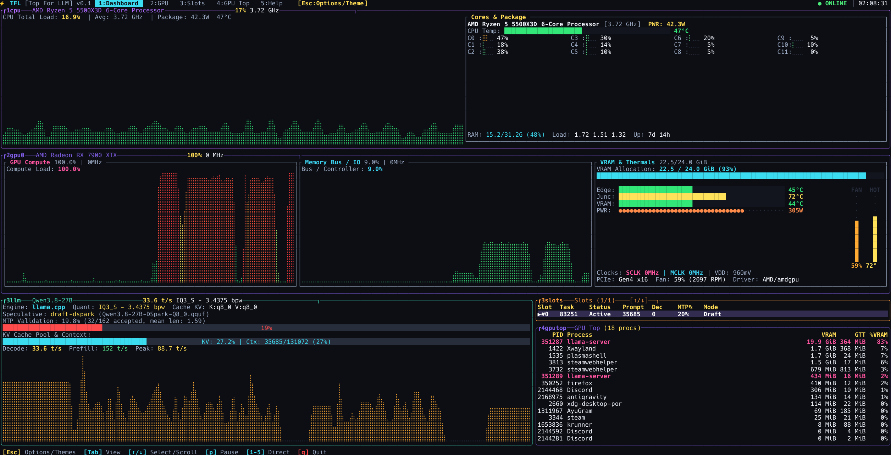

<div align="center">
  <h1>🚀 TFL (Top For LLM)</h1>
  <p><strong>A modern, high-performance TUI for local LLM inference and host hardware monitoring</strong></p>

  <p>
    <a href="https://github.com/YOUR_USERNAME/TFL/actions"></a>
    <a href="https://aur.archlinux.org/packages/tfl"></a>
    <a href="LICENSE"></a>
    <a href="https://rust-lang.org"></a>
  </p>
</div>

---

TFL (Top for LLM) — это легковесный консольный монитор (TUI), созданный для отслеживания утилизации рессурсов (CPU, RAM, GPU) и метрик локально запущенных языковых моделей (LLM) через `llama.cpp` и другие бэкенды. 

TFL объединяет функционал `btop`, `nvidia-smi` / `rocm-smi` и дашбордов для LLM в одном окне с нативным потреблением ресурсов.

## 📸 Скриншоты

<div align="center">
  
  <p><i>Главный экран: Мониторинг CPU, VRAM, слотов LLM и процессов GPU</i></p>
</div>

## ✨ Ключевые возможности

- 🖥️ **Детальный мониторинг железа:** Детальная нагрузка CPU, распределение RAM, температуры.
- 🎮 **Расширенный GPU мониторинг (NVIDIA / AMD):** Использование VRAM, вычислительных блоков, TDP, температуры, частоты.
- 🧠 **Глубокая интеграция с LLM (llama.cpp):**
  - Определение загруженной модели, квантования, типа кэша (KV Cache).
  - Отслеживание активных слотов (контекста) и их состояния.
  - Скорость генерации (Tokens/s) и время оценки промпта (Prefill).
  - Поддержка метрик **Спекулятивного декодирования (MTP/Draft Models)**
- 📊 **Мониторинг процессов DRM (Linux):** Точное отображение процессов, утилизирующих VRAM.
- 🎨 **Кастомизация и Темы:** Мгновенное переключение тем во время работы (`Options`).

## 📦 Установка

### Для Arch Linux (Сборка из PKGBUILD)
*(Пакет ожидает открытия регистрации для публикации в AUR. Пока доступна локальная сборка)*
```bash
git clone https://github.com/Vim-01/TFL.git
cd TFL/packaging/aur
makepkg -si
```

### Установка через Cargo (Любой Linux)
Если у вас установлен [Rust](https://rustup.rs/):
```bash
cargo install --git https://github.com/Vim-01/TFL.git
```

### Сборка из исходников вручную
```bash
git clone https://github.com/Vim-01/TFL.git
cd TFL
cargo build --release
sudo cp target/release/tfl /usr/local/bin/
```

## 🚀 Использование

Запустите утилиту без флагов для автоматического поиска запущенного локального сервера LLM:
```bash
tfl
```

### ⌨️ Горячие клавиши
- `1` - Главный Dashboard
- `2` - Детальная статистика GPU
- `3` - Инспектор слотов (LLM)
- `4` - GPU Top (мониторинг процессов DRM)
- `5` или `?` - Справка
- `O` (Options) - Настройки и Темы
- `Q` / `Esc` / `Ctrl+C` - Выход

## 🤝 Вклад в развитие (Contributing)

Мы приветствуем Pull Request'ы! Пожалуйста, ознакомьтесь с архитектурой в `src/`:
- `src/collector/` — сбор метрик в отдельных потоках, без блокировки UI.
- `src/ui/` — рендер интерфейса с помощью `ratatui`.

## 📄 Лицензия

TFL распространяется под лицензией **GNU AGPLv3**. Подробности в файле [LICENSE](LICENSE).

---
*Сделано с ❤️ для open-source AI сообщества.*
